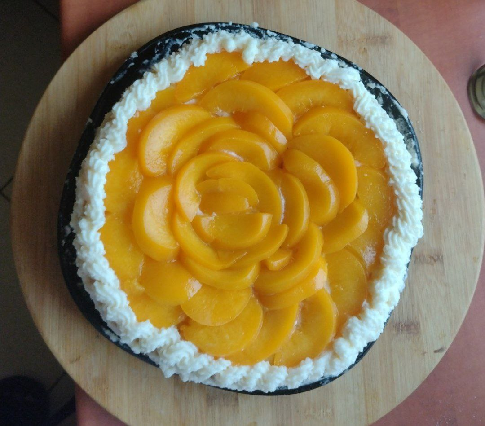

### Decorating

(Accident? [Back to the recipe](Recipie.md))

Decorating a cake isn't as easy as it sounds, so i'll explain as best as i can how i do it.

1. First we get or first layer of sponge cake and moisturise it with our syrup.
2. Next we add the cream filling making a thick line on the sides and a bit less on the inside.
3. Now we add our preferable filling, i use canned peaches. Be sure to add enough, so it has a great taste! :D
4. We cover it with more cream carefully to not to ruin our sponge cake, I added cream with a pastry bag and moved with a spatula.
5. Next we place our secong sponge cake on top.
6. We repeat the process from 1 to 3  on the second layer.
7. Finally we get our left cream and spread it on the sides while spinning it to make it perfect!

### **`Enjoy your dessert!`**

[Back to the recipe](Recipie.md)