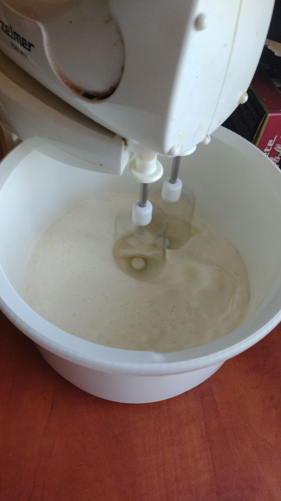
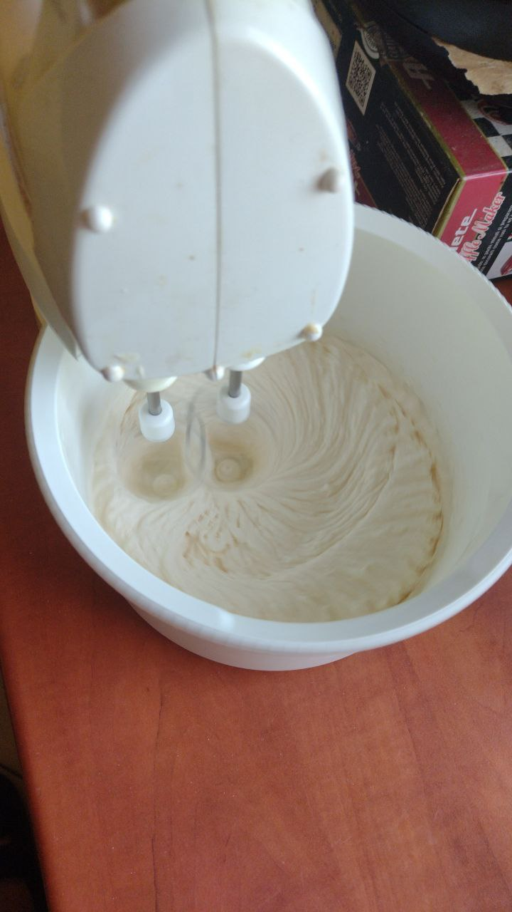

### Cream Filling

(Accident? [Back to the recipe](readme.md))

There are many cream recipes so i use the simpliest.

At first we start with 500 ml of heavy cream and start to mix it.

Next we add sugar, i use 100 g, and continue to mix until it's thick and all whipped up.

Then it's all done!

--- 

### Syrup

Syrup is used to make our sponge cake more sweet, delicate and enjoyable to the taste and texture. All we need is water, sugar and lemon.

We heat up the half cup of water on the stove and add quarter cup of sugar, next we add a bit of lemon juice to add it a good touch!

[Back to the recipe](readme.md)