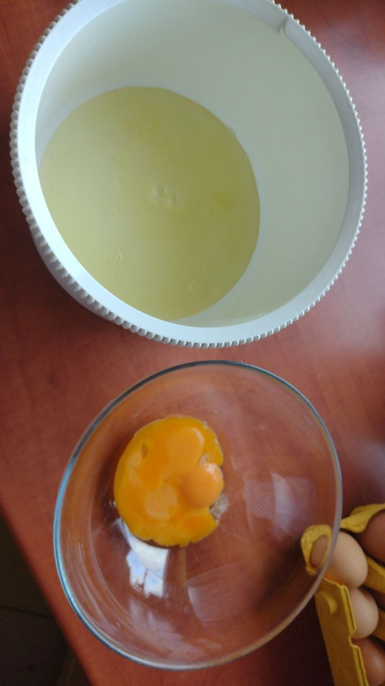
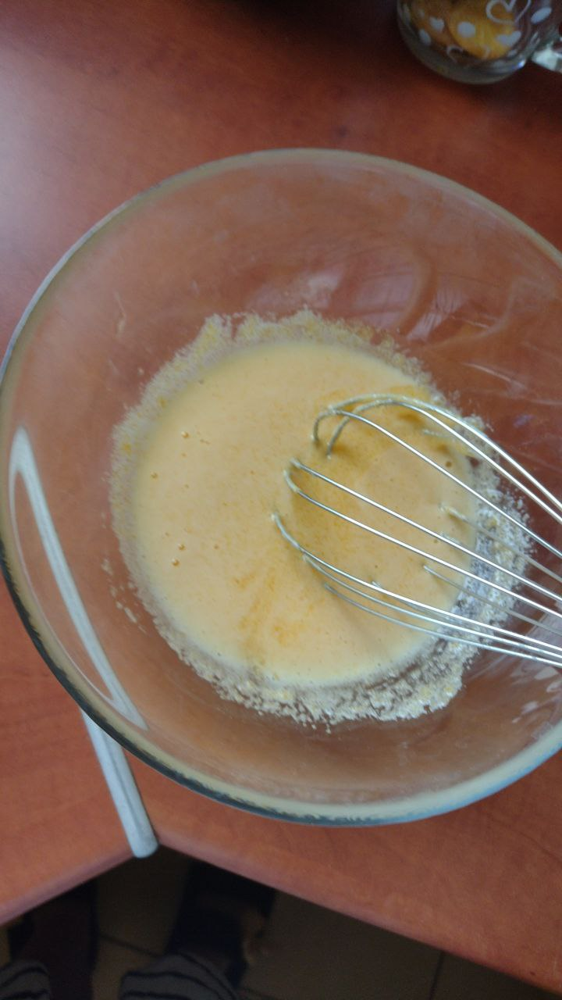
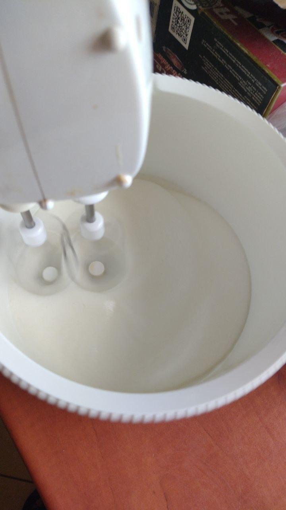
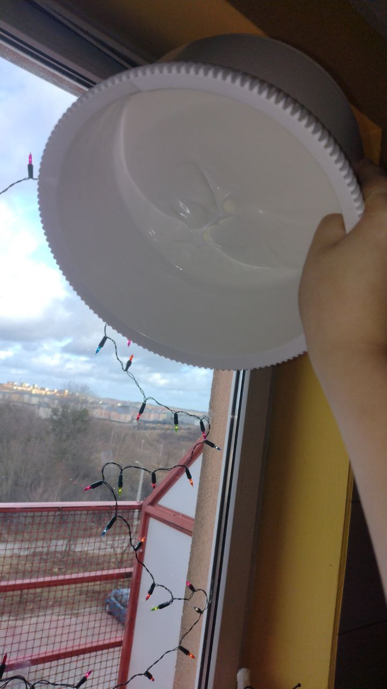
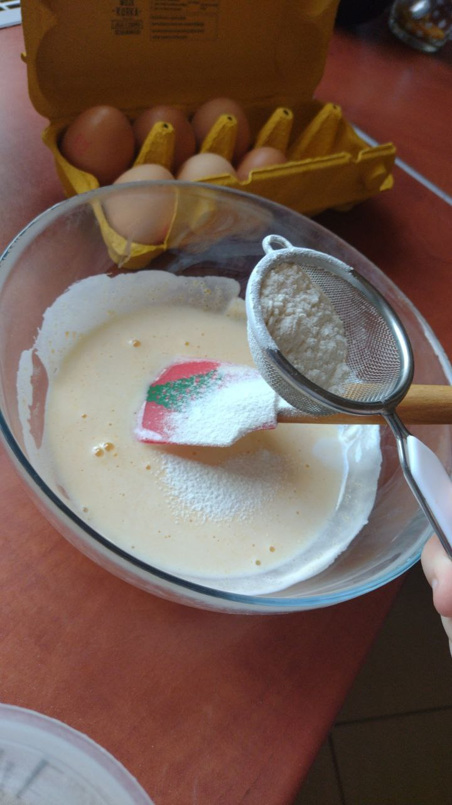
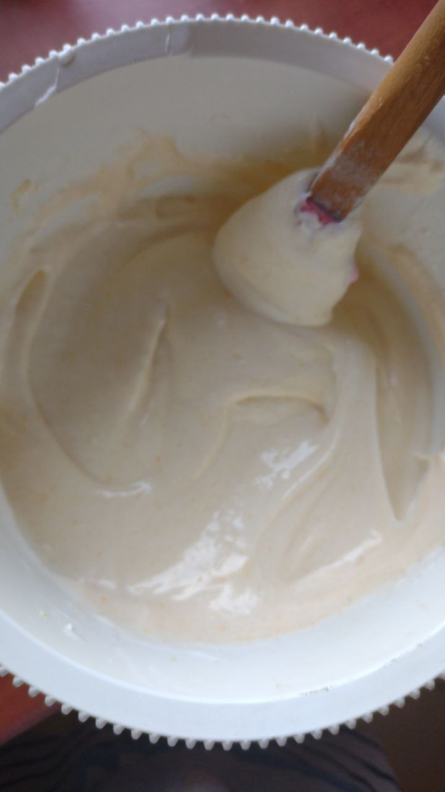
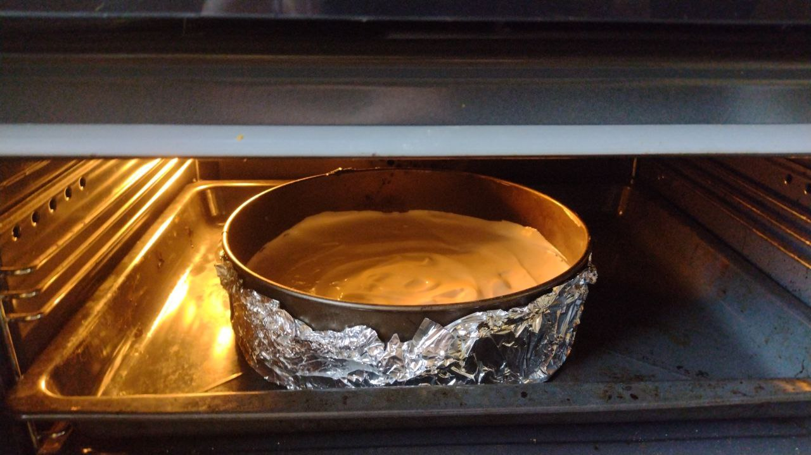

### Sponge cake

(Accident? [Back to the recipe](Recipie.md))

> *The used [recipe](https://gotovim-doma.ru/recipe/114-biskvit-klassicheskii)*

At first we start with baking two sponge cakes, so we sprit our ingredients on two equal parts.
We take 4 eggs and separate whites from the yolk.

Next we add 75g of sugar to the yold, and stir.

Meanwhile we mix whites on medium speed till it puffs.

Now, to whites we also slowly add 75g of sugar, and mix it well. 
You will know when the whites are ready when you'll be able to do this:

As you can see, it doesn't care about being upside down.

After it puffs up we add a bit of whites and 100g of flour to our yolk and gently stir.

In the end we add yolk mixure to the whites and dough it from the bottom to the top

Here we have a finished dough, and we warm up our oven to 165-170°C. Unfortunaly my oven mixes up the temperature so i set it to 175-180°C.

We transfer our dough into the mold and place it to the oven!

We let it bake for about 50 minutes, and repeat the process so we have two cake crusts.

Meanwhile I will clean up and we will continue with filling!

[Back to the recipe](Recipie.md)